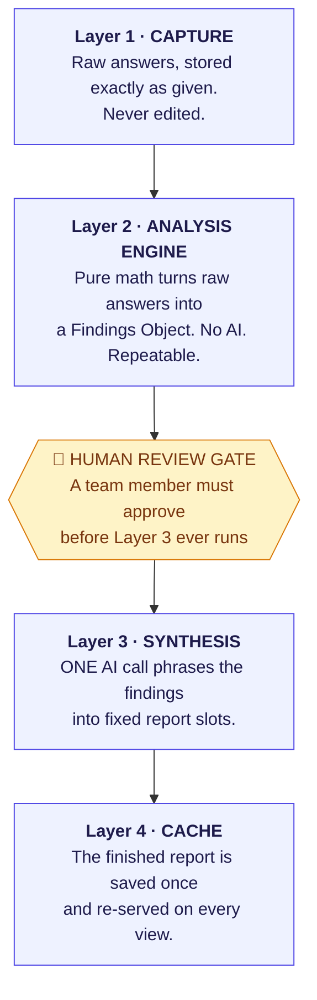
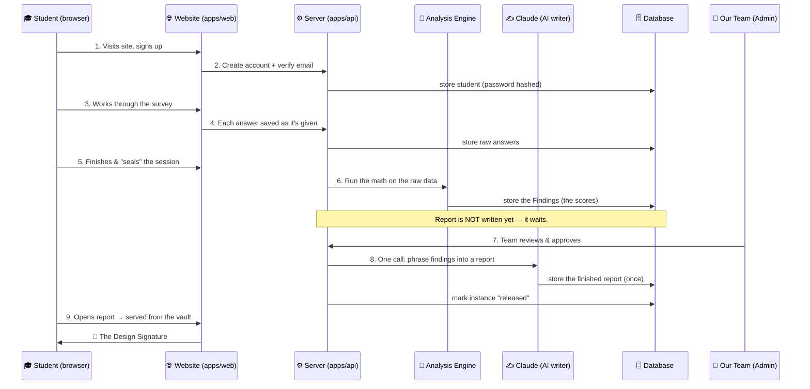

# REVEAL — System Architecture (Plain-English Blueprint)

*A visual guide to how REVEAL is built, written for founders, investors, and
partners — not just engineers. No prior software knowledge assumed.*

---

## 1. What REVEAL is, in one breath

REVEAL is a web application that helps design students discover **which kind of
designer they actually are** — by reading *what they do*, not just *what they
say they like*.

A student signs up, works through a guided survey of scenarios and small tasks,
and — after a human on our team approves it — receives a polished, personalised
**Design Signature** report: charts, plain-language insight, and tailored growth
experiments.

The whole product is three moving parts working together:

```
 ┌──────────────┐        ┌──────────────┐        ┌──────────────┐
 │   THE APP    │  talks │  THE ENGINE  │  reads │  THE MEMORY  │
 │  (what you   │ ─────► │  (the brain  │ ─────► │  (the vault  │
 │   see & tap) │        │  that scores)│        │  that stores)│
 └──────────────┘        └──────────────┘        └──────────────┘
    apps/web               apps/api                 PostgreSQL
   React website         Node.js server            the database
```

Everything else in this document explains those three boxes and how a student's
data travels between them.

---

## 2. The one big idea (why the architecture matters)

Most "AI report" products let a language model *decide* what's true about you and
*also* write it up. That is fast to build — and impossible to trust, because the
same answer can come out differently every time.

REVEAL is deliberately built the other way around. We split the job in two:

| The job | Who does it | Why it's split out |
|---|---|---|
| **Deciding what's true** about a student | Plain, fixed math (no AI) | Same inputs → *identical* result, every single time. Auditable. Defensible. |
| **Phrasing it nicely** into a report | One AI call, tightly boxed in | The AI only chooses *words*, never *verdicts*. It can't change the score. |

> **The investor takeaway:** the part of REVEAL that makes a *claim about a
> person* is deterministic and reproducible. The AI is a writer, not a judge.
> That is the core of our credibility — and it's baked into the architecture,
> not bolted on as a policy.

---

## 3. The technology, translated

Here is every major piece of technology REVEAL runs on, and what each one *is*
in everyday terms.

### The website the student sees (`apps/web`)

| Technology | What it actually is | Everyday analogy |
|---|---|---|
| **React** | The framework that builds the interactive screens | The set of LEGO bricks the storefront is built from |
| **Vite** | The tool that bundles and serves those screens | The factory that snaps the bricks into a finished shop |
| **Tailwind CSS** | The styling system (colours, spacing, the "premium" look) | The interior designer who makes every room match |
| **React Router** | Moves the student between pages without reloading | The hallways connecting the rooms |
| **React Query / Zustand** | Remembers data and app state while you use it | The shop's short-term memory during your visit |

The output is a **static website** — plain files (HTML, JavaScript, images) that
can be served from anywhere in the world, cheaply and instantly.

### The server that does the thinking (`apps/api`)

| Technology | What it actually is | Everyday analogy |
|---|---|---|
| **Node.js** | The engine that runs our server-side code | The electricity that powers the back office |
| **Fastify** | The framework that answers web requests | The receptionist who takes every request and routes it |
| **The Analysis Engine** | Our own pure-math scoring code | The examiner who grades the work by a fixed rubric |
| **Anthropic Claude** | The single AI call that writes the prose | The copywriter who turns grades into a readable report |
| **bcrypt + JWT** | Password protection and login passes | The lock on the door and the wristband you wear inside |

### The shared rulebook (`packages/shared`)

| Technology | What it actually is | Everyday analogy |
|---|---|---|
| **Zod contracts** | Strict definitions of what every piece of data must look like | The customs officer who rejects any malformed parcel |
| **Frozen enums & constants** | The fixed vocabulary and scoring numbers | The official dictionary both sides must speak |

Because the website *and* the server both import this one rulebook, they can
never drift out of sync. A question added on one side is understood by the
other automatically.

### Where everything is remembered

| Technology | What it actually is | Everyday analogy |
|---|---|---|
| **PostgreSQL** | The database — a reliable, structured filing system | The bank vault with numbered, indexed safety-deposit boxes |

---

## 4. The four layers (the heart of the design)

Inside the server, a student's data flows through **four sealed stages**. Each
stage only ever hands its result forward — it never reaches back. This is what
makes the whole thing predictable and safe.



Plain-text version of the same flow, in case the diagram doesn't render:

```
 RAW ANSWERS ─► [1 CAPTURE] ─► [2 ENGINE: the math] ─► 👤 HUMAN APPROVES
                                                              │
                                          [3 AI writes it up] ◄┘
                                                   │
                                          [4 SAVED ONCE] ─► shown to student
```

### What each layer guarantees

| Layer | What goes in | What comes out | The promise it makes |
|---|---|---|---|
| **1 · Capture** | Taps, choices, timings | Raw records, untouched | We never quietly alter what you told us |
| **2 · Engine** | Raw records | A "Findings Object" (the scores) | Same input → same findings, forever |
| **3 · Synthesis** | Findings Object | Report text in fixed slots | The AI writes; it does **not** decide |
| **4 · Cache** | Report text | The saved report | Generated once, then only ever re-served |

The database enforces the "once" promise physically: the report table can hold
**exactly one** report per student. A second attempt to write is impossible, not
just discouraged.

---

## 5. A student's journey, end to end

This is the complete trip a single student's data takes, from first click to
finished report.



Narrated, step by step:

1. **Arrive & register.** The student lands on the public site and signs up.
   Their password is never stored as text — it's scrambled with *bcrypt* so even
   we can't read it. Email is verified before they can begin.
2. **Begin the survey.** The survey is split into short sittings. The student can
   stop and resume; the server always knows the exact next question (its
   "cursor").
3. **Answer by answer.** Every choice, and even how long it took, is sent to the
   server and filed in the raw-capture vault — **exactly as given, never edited.**
4. **Seal the session.** When a sitting is complete the student seals it. Sealed
   answers are locked by the database itself and can't be altered afterward.
5. **The math runs.** Once capture is complete, the Analysis Engine turns the
   raw answers into a Findings Object — the student's capacities, values, working
   style, and the conditions their work needs. **No AI is involved here.**
6. **It waits for a human.** Crucially, the report is *not* generated yet. The
   instance sits in a queue for our team.
7. **A team member approves.** An admin reviews the findings — especially any
   "high-stakes" or surprising results — and approves.
8. **The AI writes, once.** Only now does a single Claude call run, turning the
   findings into polished prose that fills a fixed set of report slots. The
   result is saved permanently.
9. **The student reads it.** From this point on, opening the report just re-serves
   the saved copy. It never regenerates, so it never changes underneath them.

> If we ever have no AI key configured (or set `SYNTHESIS_MODE=manual`), the
> system falls back to a built-in deterministic writer. **The entire product
> works end-to-end with zero AI calls** — the AI is an enhancement, not a
> dependency.

---

## 6. What we actually store (the data model)

The database is organised as a clean "spine" — one student has one report
instance, which has one raw-capture record, which produces one findings record,
which produces one report. Everything hangs off that line.

```
student ─┬─ report_instance ─┬─ raw_capture      (Layer 1: the raw answers)
         │                    ├─ derived          (Layer 2: the computed findings)
         │                    ├─ report_payload   (Layer 4: the finished report — max 1)
         │                    ├─ capture_session  (the sittings & resume point)
         │                    ├─ module_response  (each answer; sealable & locked)
         │                    ├─ upload           (portfolio images, resume)
         │                    └─ review           (the human approval record)
         └─ (login, profile, consent)

staff ── the admin team (also password-protected)

instrument_version ─┬─ a_item / a_option   the survey questions & choices
                     ├─ b_task              the behavioural tasks
                     ├─ artifact            the image-grid for visual sorts
                     └─ scoring_constant    the numbers the engine grades by
```

| Table | Holds | Layer |
|---|---|---|
| `student` | Account, profile, consent | — |
| `report_instance` | One attempt; tracks status | spine |
| `raw_capture` | Every raw answer, untouched | 1 · Capture |
| `derived` | The Findings Object (the scores) | 2 · Engine |
| `report_payload` | The final report — **one row max** | 4 · Cache |
| `review` | Who approved, and their notes | Human gate |
| `instrument_*` | The questions/tasks themselves, versioned & admin-editable | Content |

Two design details worth calling out to a technical partner:

- **The survey content lives in the database, versioned.** Our team can edit
  questions through an admin portal without a developer or a redeploy.
- **Sealed answers are protected by the database itself** — a built-in rule
  rejects any attempt to change an answer once its session is sealed. Integrity
  isn't left to trust; it's enforced at the vault door.

---

## 7. Where the AI is — and, deliberately, isn't

```
                       ┌─────────────────────────────────────┐
   RAW ANSWERS ───────►│  ANALYSIS ENGINE   (pure math)      │
                       │  • capacities, values, roles        │
                       │  • working style, needed conditions │
                       │  • market tension, coherence checks │
                       │        NO AI. Fully reproducible.   │
                       └──────────────────┬──────────────────┘
                                          │ Findings Object
                                          ▼
                       ┌─────────────────────────────────────┐
                       │  SYNTHESIS   (exactly one AI call)   │
                       │  • takes the findings as fixed facts │
                       │  • writes them into fixed slots      │
                       │  • low "temperature" → steady voice  │
                       │        Chooses WORDS, not VERDICTS.  │
                       └─────────────────────────────────────┘
```

Every judgement REVEAL makes about a person is produced by the engine and can be
recomputed and audited at any time. The AI never sees a student's raw data as a
blank canvas — it receives a finished, structured verdict and is asked only to
express it well. This is the single most important architectural decision in the
product, and it is what lets us stand behind every report.

---

## 8. Security & privacy posture (at a glance)

| Concern | How the architecture handles it |
|---|---|
| **Passwords** | Never stored as text — hashed with bcrypt, one-way |
| **Login sessions** | Signed JWT passes with an expiry; no server-side session to leak |
| **Who can do what** | Students and admins have separate, enforced roles (RBAC) |
| **Bad/malicious input** | Every request is validated against the shared Zod contracts before it touches the database |
| **Consent** | Recorded explicitly per student before capture begins |
| **Data integrity** | Sealed answers are immutable; reports generate exactly once |
| **Transport** | Database connections use SSL in production |

---

## 9. The monorepo map (for the technical reader)

Everything lives in one repository, split into three packages managed by `pnpm`.

```
reveal/
├── packages/shared/    The shared rulebook — enums, scoring constants,
│                       Zod contracts, report slots, scenario definitions.
│                       Imported by BOTH web and api so they never disagree.
│
├── apps/api/           The Node.js + Fastify server. Contains the four-layer
│   ├── src/engine/       Layer 2 · the pure-math analysis engine
│   ├── src/synthesis/    Layer 3 · the single AI call (+ deterministic fallback)
│   ├── src/routes/       the web endpoints (auth, capture, report, admin…)
│   ├── src/repositories/ the code that reads/writes the database
│   └── src/db/           schema migrations + seed data
│
└── apps/web/           The React + Vite + Tailwind website the student uses.
    └── src/features/     landing, auth, survey capture, dashboard, report, admin

Ready-made deploy configs sit at the repo root — `vercel.json` (website) and
`render.yaml` (API + database). See the deployment plan.
```

The four-layer pipeline described above lives inside `apps/api/src`. The engine
is the crown jewel: pure functions with no database or network access, which is
exactly why it's so easy to test and trust.

---

## 10. Mini-glossary

| Term | Plain meaning |
|---|---|
| **Frontend / web** | The part you see and click in the browser |
| **Backend / API / server** | The part that runs privately and does the work |
| **Database** | The permanent, structured store of everything |
| **Deterministic** | Same input always gives the same output |
| **Findings Object** | The engine's structured verdict about a student |
| **Synthesis** | Turning that verdict into readable report prose |
| **Cache** | A saved copy that's re-served instead of re-made |
| **Migration** | A versioned change to the database's shape |
| **Seed** | Loading the starting content (questions, admins) |
| **Monorepo** | One codebase holding several related projects |

---

*This document describes how REVEAL is built. For how to put it live on the
internet at no cost, see [`ZERO_COST_DEPLOYMENT_PLAN.md`](./ZERO_COST_DEPLOYMENT_PLAN.md).*
